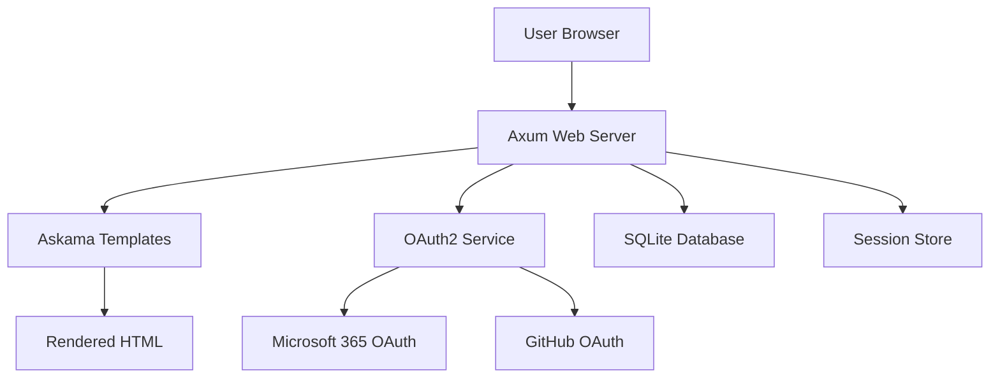

# Design Document

## Overview

The SSO Web Application is a Rust-based web service built with the Axum framework that provides secure authentication through Microsoft 365 and GitHub OAuth2 providers. The application follows a traditional server-side rendered architecture using Askama templates, with SQLite for data persistence and session-based authentication.

## Architecture

### High-Level Architecture



### Technology Stack

- **Web Framework**: Axum (async Rust web framework)
- **Templating**: Askama (compile-time Jinja2-like templates)
- **Database**: SQLite with sqlx for async database operations
- **Authentication**: OAuth2 with Microsoft 365 and GitHub providers
- **Session Management**: Tower-sessions with cookie-based sessions
- **HTTP Client**: reqwest for OAuth2 API calls

## Components and Interfaces

### 1. Web Server Layer (Axum)

**Router Configuration**:
- `GET /` - Login page (redirects to `/dashboard` if authenticated)
- `GET /login` - Explicit login page
- `GET /auth/microsoft` - Microsoft OAuth2 initiation
- `GET /auth/github` - GitHub OAuth2 initiation
- `GET /auth/callback/microsoft` - Microsoft OAuth2 callback
- `GET /auth/callback/github` - GitHub OAuth2 callback
- `GET /dashboard` - Protected user dashboard
- `POST /logout` - Logout endpoint

**Middleware Stack**:
- Session middleware for session management
- Authentication middleware for protected routes
- CORS middleware for security
- Logging middleware for request tracking

### 2. Authentication Service

```rust
pub struct AuthService {
    microsoft_client: OAuth2Client,
    github_client: OAuth2Client,
    user_repository: UserRepository,
}

impl AuthService {
    pub async fn initiate_microsoft_auth(&self) -> Result<String, AuthError>;
    pub async fn initiate_github_auth(&self) -> Result<String, AuthError>;
    pub async fn handle_microsoft_callback(&self, code: String) -> Result<User, AuthError>;
    pub async fn handle_github_callback(&self, code: String) -> Result<User, AuthError>;
}
```

### 3. User Repository

```rust
pub struct UserRepository {
    pool: SqlitePool,
}

impl UserRepository {
    pub async fn find_by_provider_id(&self, provider: &str, provider_id: &str) -> Result<Option<User>, DbError>;
    pub async fn create_user(&self, user: CreateUser) -> Result<User, DbError>;
    pub async fn update_last_login(&self, user_id: i64) -> Result<(), DbError>;
}
```

### 4. Template System

**Templates Structure**:
- `templates/base.html` - Base layout template
- `templates/login.html` - Login page template
- `templates/dashboard.html` - User dashboard template
- `templates/error.html` - Error page template

**Template Context Structs**:
```rust
#[derive(Template)]
#[template(path = "login.html")]
pub struct LoginTemplate;

#[derive(Template)]
#[template(path = "dashboard.html")]
pub struct DashboardTemplate {
    pub username: String,
}
```

## Data Models

### User Model

```rust
#[derive(Debug, Clone, sqlx::FromRow)]
pub struct User {
    pub id: i64,
    pub provider: String,           // "microsoft" or "github"
    pub provider_id: String,        // OAuth provider's user ID
    pub username: String,           // Display name
    pub email: Option<String>,      // User's email if available
    pub avatar_url: Option<String>, // Profile picture URL
    pub created_at: DateTime<Utc>,
    pub last_login: DateTime<Utc>,
}

#[derive(Debug)]
pub struct CreateUser {
    pub provider: String,
    pub provider_id: String,
    pub username: String,
    pub email: Option<String>,
    pub avatar_url: Option<String>,
}
```

### Session Model

Sessions are managed by tower-sessions with the following data:
```rust
pub struct SessionData {
    pub user_id: i64,
    pub username: String,
    pub provider: String,
}
```

### Database Schema

```sql
CREATE TABLE users (
    id INTEGER PRIMARY KEY AUTOINCREMENT,
    provider TEXT NOT NULL,
    provider_id TEXT NOT NULL,
    username TEXT NOT NULL,
    email TEXT,
    avatar_url TEXT,
    created_at DATETIME DEFAULT CURRENT_TIMESTAMP,
    last_login DATETIME DEFAULT CURRENT_TIMESTAMP,
    UNIQUE(provider, provider_id)
);

CREATE INDEX idx_users_provider_id ON users(provider, provider_id);
```

## Error Handling

### Error Types

```rust
#[derive(Debug, thiserror::Error)]
pub enum AppError {
    #[error("Database error: {0}")]
    Database(#[from] sqlx::Error),
    
    #[error("Authentication error: {0}")]
    Auth(#[from] AuthError),
    
    #[error("Template error: {0}")]
    Template(#[from] askama::Error),
    
    #[error("HTTP client error: {0}")]
    Http(#[from] reqwest::Error),
}

#[derive(Debug, thiserror::Error)]
pub enum AuthError {
    #[error("OAuth2 state mismatch")]
    StateMismatch,
    
    #[error("Failed to exchange code for token")]
    TokenExchange,
    
    #[error("Failed to fetch user profile")]
    ProfileFetch,
    
    #[error("User not authenticated")]
    NotAuthenticated,
}
```

### Error Response Strategy

- **Authentication Errors**: Redirect to login page with error message
- **Database Errors**: Return 500 Internal Server Error with generic message
- **Template Errors**: Return 500 Internal Server Error
- **OAuth2 Errors**: Redirect to login page with specific error message

## Testing Strategy

### Unit Tests

1. **Authentication Service Tests**:
   - Test OAuth2 URL generation
   - Test token exchange logic
   - Test user profile parsing
   - Mock HTTP clients for external API calls

2. **Repository Tests**:
   - Test user creation and retrieval
   - Test database constraint handling
   - Use in-memory SQLite for test isolation

3. **Template Tests**:
   - Test template rendering with various data
   - Test template error handling

### Integration Tests

1. **End-to-End Authentication Flow**:
   - Test complete OAuth2 flow with mock providers
   - Test session creation and validation
   - Test protected route access

2. **Database Integration**:
   - Test database migrations
   - Test concurrent user operations
   - Test session persistence

### Test Environment Setup

- Use `sqlx-test` for database test isolation
- Mock OAuth2 providers using `wiremock`
- Use `axum-test` for HTTP endpoint testing
- Implement test fixtures for common user scenarios

## Security Considerations

1. **Session Security**:
   - Use secure, HTTP-only cookies
   - Implement CSRF protection
   - Set appropriate session timeouts

2. **OAuth2 Security**:
   - Validate state parameter to prevent CSRF
   - Use PKCE for additional security
   - Validate redirect URIs

3. **Database Security**:
   - Use parameterized queries (sqlx handles this)
   - Implement proper error handling to avoid information leakage
   - Regular security updates for dependencies

## Configuration

Environment variables required:
- `DATABASE_URL`: SQLite database file path
- `MICROSOFT_CLIENT_ID`: Microsoft OAuth2 client ID
- `MICROSOFT_CLIENT_SECRET`: Microsoft OAuth2 client secret
- `GITHUB_CLIENT_ID`: GitHub OAuth2 client ID
- `GITHUB_CLIENT_SECRET`: GitHub OAuth2 client secret
- `SESSION_SECRET`: Secret key for session encryption
- `BASE_URL`: Application base URL for OAuth2 callbacks